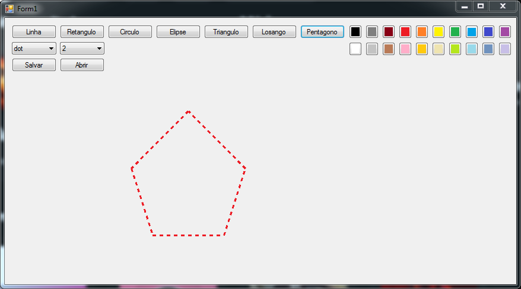

# projeto2-icg
<p align="center">
  <a href="https://github.com/shioheii">
    
  </a>
  <a href="https://github.com/arthurfbn">
    
  </a> <br>
  <a href="#">
    
  </a>
  <a href="#">
    
  </a>
  <a href="#">
    
  </a>
  <a href="#">
    
  </a><br />
</p>

Projeto do 2° Bimestre da matéria de Introdução à Computação Gráfica

## Sobre o projeto
A proposta do projeto era desenvolver uma interface que permita efetuar um “Graphical Editor”, semelhante ao Paint, onde seria possível realizar vários tipos de desenhos a partir do click do mouse.



## O que aprendi?
- Utilizar o conceito de primitivas gráficas de forma mais eficiente.
- Criação de tipos de linha, cores e desenhos variados.
- Salvar dados do desenho em um arquivo, e depois poder refazer este desenho, apenas abrindo o arquivo dentro do software.

## Recursos utilizados
- Linguagem: C#
- Ferramenta/IDE: [Visual Studio](https://visualstudio.microsoft.com/pt-br/)

## Executar projeto na sua máquina:
Para executar este projeto no seu computador, basta clicar em "Code" e depois em "Download ZIP":


Ou clone o repositório pelo link:
```bash
$ git https://github.com/shioheii/projeto2-icg.git
```

Então execute o arquivo "projeto.sln" que é a solução do projeto.

---

<p align="center">
  <a alt="Bruno Shiohei Kinoshita do Nascimento Linkedin" href="https://www.linkedin.com/in/bruno-shiohei/">
    
  </a>
  <a alt="Bruno Shiohei Kinoshita do Nascimento GitHub" href="https://github.com/shioheii">
    
  </a>
</p>
