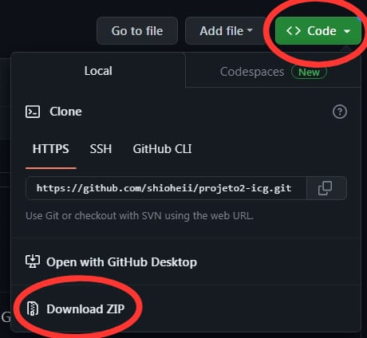

# projeto2-icg
<a href="https://github.com/shioheii">
  
</a>
<a href="#">
  
</a>
<a href="#">
  
</a>
<a href="#">
  
</a>
<a href="#">
  
</a><br />

Projeto do 2° Bimestre da matéria de Introdução à Computação Gráfica

## Sobre o projeto
bla bla bla


## O que aprendi?
bla bla bla

## Recursos utilizados
- Linguagem: C#
- Ferramenta/IDE: [Visual Studio](https://visualstudio.microsoft.com/pt-br/)

## Executar projeto na sua máquina:
Para executar este projeto no seu computador, basta clicar em "Code" e depois em "Download ZIP":


Ou clone o repositório pelo link:
```bash
$ git https://github.com/shioheii/projeto2-icg.git
```

Então execute o arquivo "projeto.sln" que é a solução do projeto.

---

<p align="center">
  <a alt="Bruno Shiohei Kinoshita do Nascimento Linkedin" href="https://www.linkedin.com/in/bruno-shiohei/">
    
  </a>
  <a alt="Bruno Shiohei Kinoshita do Nascimento GitHub" href="https://github.com/shioheii">
    
  </a>
</p>
